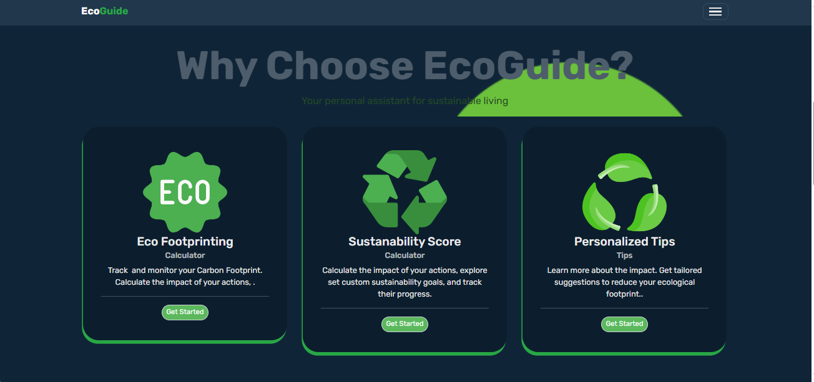
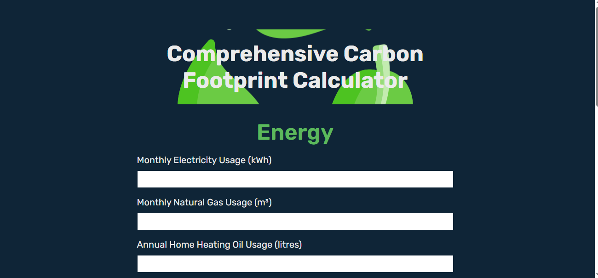
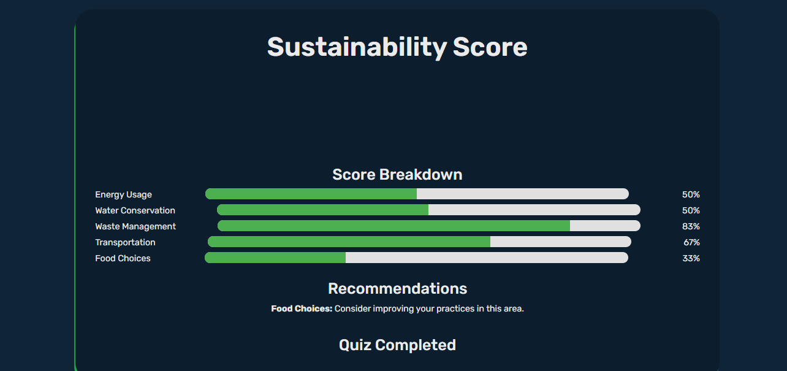
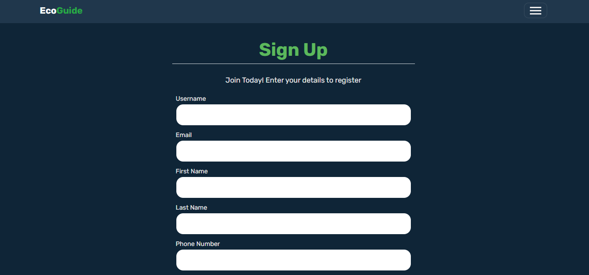
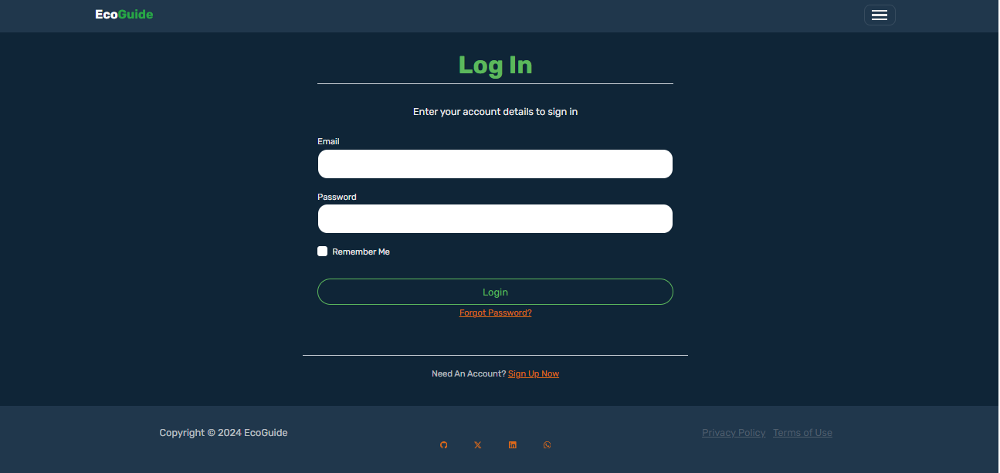

# EcoGuide
**Your Personalized Path to Sustainable Living**


## Overview
EcoGuide is a comprehensive platform designed to help individuals, families, and small businesses adopt more sustainable living practices. By leveraging user data and various environmental APIs, EcoGuide provides tailored, actionable recommendations to help you reduce your carbon footprint and make eco-friendly choices.

## App Features

EcoGuide offers a suite of tools to support your journey toward sustainability. Here’s a detailed look at its core features:

### 1. Eco Footprinting Calculator
- **Description**: Monitor and track your carbon footprint by assessing the environmental impact of your daily activities. This tool provides insights to help you understand and reduce your carbon footprint.

### 2. Sustainability Score Calculator
- **Description**: Set personalized sustainability goals and evaluate the impact of your actions. Track your progress over time with measurable improvements toward a greener lifestyle.

### 3. Personalized Tips
- **Description**: Receive customized recommendations to reduce your ecological footprint. Based on your data, EcoGuide offers actionable suggestions to help you make more sustainable choices.

### 4. Interactive Impact Assessment
- **Description**: Evaluate the overall impact of your lifestyle choices on the environment. This interactive tool allows you to explore different scenarios, set goals, and monitor your progress in real-time.

### 5. Localized Weather Insights
- **Description**: Access personalized weather information tailored to your local environment and climate. Make informed decisions based on real-time and forecasted weather data to support eco-friendly practices.

### 6. Participate in Eco Challenges
- **Description**: Join sustainability challenges designed to encourage positive environmental actions. Connect with a community of like-minded individuals and track your contributions toward a greener future.

### 7. User Account and Progress Tracking
- **Description**: Create and manage your account to save your progress, set goals, and receive personalized recommendations. This feature ensures continuous and customized support throughout your sustainability journey.

### 8. Sign Up and Get Started
- **Description**: Begin your eco-friendly journey today. Sign up to start tracking your carbon footprint, receive personalized recommendations, and take the first step towards a more sustainable lifestyle with EcoGuide.

---

EcoGuide provides a user-friendly platform with essential tools for sustainable living. Whether you are beginning your journey or looking to enhance your current practices, EcoGuide is equipped to support and guide you.

---

## Technologies
- **Frontend**: Bootstrap, HTML5, Javascript and jQuery
- **Backend**: Flask Framework
- **Database**: PostgreSQL, MySQL, Flask SQLAlchemy
- **APIs**: OpenWeatherMap API, Carbon Interface API
- **Cloud Platform**: Heroku, Containerization
- **Version Control**: Git, GitHub
- **Testing**: Unittests

## Models

## Screenshots

Here’s a visual preview of EcoGuide’s features and interface:

|  |  |
|:---------------------------------------------:|:-------------------------------------------------:|
|        **Eco Footprinting Calculator**        |        **Sustainability Score Calculator**        |

|  |  |
|:-----------------------------------:|:-----------------------------------------------:|
|        **Personalized Tips**        |        **Interactive Impact Assessment**        |

|  |  |
|:--:|:-----------------------------------------------:|
| **Localized Weather Insights** |        **Participate in Eco Challenges**        |

|  |  |
|:----------------------------------------------------:|:-----------------------------------------:|
|        **User Account and Progress Tracking**        |        **Sign Up and Get Started**        |


# - Database Models
----------------------------------------------------

This section explains the database models used in our application. Below is a detailed description of each model and its relationships.

## Models

### Role
- **Table Name**: `roles`
- **Columns**:
  - `id`: Integer, Primary Key
  - `name`: String(64), Unique
- **Relationships**:
  - `users`: One-to-Many relationship with `User`

### User
- **Table Name**: `users`
- **Columns**:
  - `id`: Integer, Primary Key
  - `username`: String(64), Indexed, Unique
  - `email`: String(120), Indexed, Unique
  - `password_hash`: String(128)
  - `first_name`: String(64)
  - `last_name`: String(64)
  - `phone_number`: String(20)
  - `reset_token`: String(100)
  - `reset_token_expiration`: DateTime
  - `role_id`: Integer, Foreign Key (`roles.id`)
- **Relationships**:
  - `activities`: One-to-Many relationship with `Activity`
  - `recommendations`: One-to-Many relationship with `Recommendation`
  - `user_challenges`: One-to-Many relationship with `UserChallenges`
  - `carbon_footprint`: One-to-One relationship with `CarbonFootprint`
  - `address`: One-to-One relationship with `Address`

### Address
- **Table Name**: `addresses`
- **Columns**:
  - `id`: Integer, Primary Key
  - `street`: String(128)
  - `city`: String(64)
  - `state`: String(64)
  - `country`: String(64)
  - `user_id`: Integer, Foreign Key (`users.id`)

### Activity
- **Table Name**: `activities`
- **Columns**:
  - `id`: Integer, Primary Key
  - `user_id`: Integer, Foreign Key (`users.id`)
  - `activity_type`: String(20)
  - `description`: String(200)
  - `carbon_impact`: Float
  - `date`: Date, Default to current date

### Recommendation
- **Table Name**: `recommendations`
- **Columns**:
  - `id`: Integer, Primary Key
  - `title`: String(100)
  - `description`: String(500)
  - `impact`: Float
  - `user_id`: Integer, Foreign Key (`users.id`)

### Contact
- **Table Name**: `contacts`
- **Columns**:
  - `id`: Integer, Primary Key
  - `name`: String(64), Indexed
  - `email`: String(120), Indexed
  - `message`: Text
  - `timestamp`: DateTime, Indexed, Default to current date

### UserChallenges
- **Table Name**: `user_challenges`
- **Columns**:
  - `id`: Integer, Primary Key
  - `user_id`: Integer, Foreign Key (`users.id`)
  - `challenge_id`: Integer, Foreign Key (`eco_challenges.id`)
- **Relationships**:
  - `eco_challenge`: Many-to-One relationship with `EcoChallenges`

### CarbonFootprint
- **Table Name**: `carbon_footprints`
- **Columns**:
  - `id`: Integer, Primary Key
  - `user_id`: Integer, Foreign Key (`users.id`)
  - `footprint`: Float

### EcoChallenges
- **Table Name**: `eco_challenges`
- **Columns**:
  - `id`: Integer, Primary Key
  - `name`: String(80)
  - `description`: Text

## User Loader
The `load_user` function is used to load a user by their ID for Flask-Login.

## Password Management
The `User` model includes methods for setting and checking passwords, as well as generating and verifying password reset tokens.

## Token Management
The `User` model includes methods for generating and verifying password reset tokens using `itsdangerous.TimedSerializer`.

## Contact
The `Contact` model is used to store contact messages from users, including their name, email, message, and timestamp.

## Usage
To use these models, import the `db` object from your application and create the tables using `db.create_all()`.

```python
from app import db
db.create_all()
```

## Team
**Martin Nyemba**: Full-stack Developer and Project Lead  
As the sole developer, I handle all aspects of EcoGuide, including design, development, testing, and deployment. This approach ensures streamlined decision-making and consistent implementation.

## Author
**Martin Nyemba**