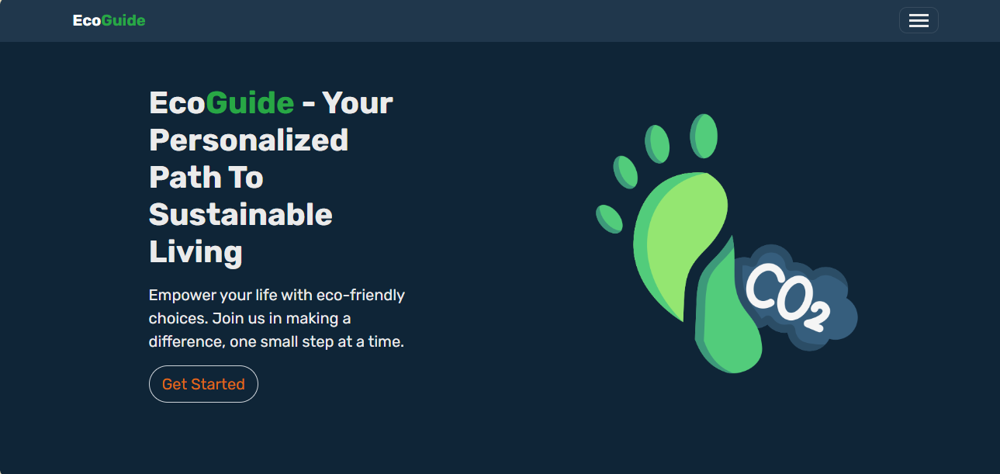

# EcoGuide

## Your Personalized Path to Sustainable Living

EcoGuide is a web application designed to empower individuals and organizations to calculate there carbon footprint and support their journey towards sustainable living by providing tools to understand, track, and reduce their carbon footprint.

[Visit EcoGuide](http://ecoguide-app-85a02a75659d.herokuapp.com/) | [Read the Project Blog](https://medium.com/@martin-nyemba/ecoguide-journey-to-sustainable-living-12345abcdef)

## Table of Contents
- [Introduction](#introduction)
- [Features](#features)
- [Installation](#installation)
  - [Traditional Setup](#traditional-setup)
  - [Docker Setup](#docker-setup)
- [Usage](#usage)
- [Technology Stack](#technology-stack)
- [API Reference](#api-reference)
- [Contributing](#contributing)
- [Screenshots](#screenshots)
- [Core project structure and main files](#core-project-structure-and-main-files)
- [Related Projects](#related-projects)
- [Licensing](#licensing)
- [Contact](#contact)

## Introduction
EcoGuide was inspired by the critical need for individuals to accurately calculate and understand their impact on climate and the environment.

Our core mission is to empower users to measure their carbon footprint and make informed decisions for sustainable living.

We aim to bridge the gap between environmental awareness and actionable, personalized steps towards reducing one's carbon footprint.
In an era where climate change and environmental degradation are pressing global issues, EcoGuide serves as a personal environmental impact advisor. By leveraging modern technology and data from reliable sources, EcoGuide helps users make informed decisions about their lifestyle choices and their impact on the environment.

### Author

**Martin Nyemba** - Full Stack Developer

[LinkedIn](https://www.linkedin.com/in/martin-nyemba-chikaya/) | [GitHub](https://github.com/martinnyemba)

## Features

EcoGuide offers a suite of tools to support your journey toward sustainability. Here’s a detailed look at its core features:


### 1. Carbon Footprint Calculator
- **Description**: Monitor and track your carbon footprint by assessing the environmental impact of your daily activities. This tool provides insights to help you understand and reduce your carbon footprint.

### 2. Sustainability Quiz
- **Description**: Set personalized sustainability goals and evaluate the impact of your actions. Track your progress over time with measurable improvements toward a greener lifestyle.

### 3. Personalized Recommendations for Sustainable Living
- **Description**: Receive customized recommendations to reduce your ecological footprint. Based on your data, EcoGuide offers actionable suggestions to help you make more sustainable choices.

### 4. Interactive Impact Assessment
- **Description**: Evaluate the overall impact of your lifestyle choices on the environment. This interactive tool allows you to explore different scenarios, set goals, and monitor your progress in real-time.

### 5. Local Weather and Air Quality Insights
- **Description**: Access personalized weather information tailored to your local environment and climate. Make informed decisions based on real-time and forecasted weather data to support eco-friendly practices.

### 6. Eco-Challenges and Community Engagement
- **Description**: Join sustainability challenges designed to encourage positive environmental actions. Connect with a community of like-minded individuals and track your contributions toward a greener future.

## Installation

### Traditional Setup

To set up EcoGuide locally, follow these steps:

```bash
# Clone the repository
git clone https://github.com/martinnyemba/EcoGuide.git

# Navigate to the project directory
cd EcoGuide

# Create a virtual environment
python3 -m venv venv

# Activate the virtual environment
source venv/bin/activate  # On Windows, use `venv\Scripts\activate`

# Install dependencies
pip install -r requirements.txt

# Set up environment variables
cp .env.example .env
# Edit .env with your API keys and database settings

# Initialize the database
flask db upgrade

# Run the application
flask run
```

### Docker Setup

If you prefer using Docker, follow these steps to run EcoGuide:

1. Ensure you have Docker and Docker Compose installed on your system.

2. Clone the repository:
   ```bash
   git clone https://github.com/martinnyemba/EcoGuide.git
   cd EcoGuide
   ```

3. Create a `.env` file in the project root and add your environment variables:
   ```bash
   cp .env.example .env
   # Edit .env with your API keys and other settings
   ```

4. Build and run the Docker containers:
   ```bash
   docker-compose up --build
   ```

   This command will build the Docker image and start the containers for the EcoGuide app and its PostgreSQL database.

5. The application will be available at `http://localhost:8000`.

6. To stop the containers, use:
   ```bash
   docker-compose down
   ```

7. For subsequent runs (if you haven't changed the Dockerfile or requirements), you can simply use:
   ```bash
   docker-compose up
   ```

Note: The Docker setup uses PostgreSQL as the database, even in development, to ensure consistency with the production environment.

## Usage

After installation, you can access EcoGuide at `http://localhost:8000`. Here's how to use the main features:

1. **Calculate Your Carbon Footprint**: Navigate to the calculator page and input your lifestyle data.
2. **View Recommendations**: After calculation, you'll receive personalized suggestions for reducing your carbon footprint.
3. **Check Local Insights**: Enter your location to view current weather and air quality data.
4. **Join Eco-Challenges**: Participate in community challenges from the Challenges page.

For a more detailed guide, please refer to our [User Manual](https://github.com/martinnyemba/EcoGuide/blob/main/README.md).

## Technology Stack

- **Frontend**: Bootstrap, HTML5, Javascript and jQuery
- **Backend**: Python
- **Framework**: Flask Framework
- **Database**: PostgreSQL, MySQL, Flask SQLAlchemy
- **APIs**: OpenWeatherMap API, Carbon Interface API
- **Cloud Platform**: Heroku Platform
- **Containerization**: Docker
- **Version Control**: Git, GitHub
- **Testing**: Unittests

## API Reference

EcoGuide uses the following APIs:

- [Carbon Interface API](https://www.carboninterface.com/docs)
- [OpenWeatherMap API](https://openweathermap.org/api)

Please refer to their respective documentation for more information on usage and endpoints.

## Contributing

We welcome contributions to EcoGuide! Here's how you can help:

1. Fork the repository
2. Create your feature branch (`git checkout -b feature/AmazingFeature`)
3. Commit your changes (`git commit -m 'Add some AmazingFeature'`)
4. Push to the branch (`git push origin feature/AmazingFeature`)
5. Open a Pull Request

Please read [CONTRIBUTING.md](CONTRIBUTING.md) for details on our code of conduct and the process for submitting pull requests.

## Screenshots

Here’s a visual preview of EcoGuide’s features and interface:

|  |            |
|:---------------------------------------------:|:-------------------------------------------------------------:|
|      **Carbon Footprinting Calculator**       |              **Sustainability Quiz Calculator**               |

|  |  |
|:-----------------------------------:|:-----------------------------------------------:|
|        **Personalized Tips**        |        **Interactive Impact Assessment**        |

|  |  |
|:--------------------------------------------:|:------------------------------:|
|        **Localized Weather Insights**        |        **User Profile**        |

|  |  |
|:----------------------------------------------------:|:------------------------------------------:|
|        **User Account and Progress Tracking**        |        **Sign Up and Get Started**         |

## Core project structure and main files

```
ecoguide/
│
├── app/
│   ├── __init__.py
│   ├── models.py
│   ├── routes/
│   │   ├── __init__.py
│   │   ├── main.py
│   │   ├── auth.py
│   │   ├── user.py
│   │   └── admin.py
│   ├── static/
│   │   ├── assets/
│   │   │   ├── js/
│   │   │   ├── css/
│   │   │   ├── img/
│   │   │   └── bootstrap/
│   ├── templates/
│   │   ├── base.html
│   │   ├── index.html
│   │   ├── contact.html
│   │   ├── features.html
│   │   ├── how-it-works.html
│   │   ├── errors/
│   │   ├── auth/
│   │   ├── user/
│   │   └── admin/
│   ├── forms.py
│   ├── weather.py
│   ├── carbon_interface.py
│   └── utils.py
│
├── screenshots/
├── tests/
├── migrations/
├── instance/
├── config.py
├── requirements.txt
├── .env
├── .gitignore
├── .dockerignore
├── .env.example
├── Procfile
├── Dockerfile
├── docker-compose.yml
├── README.md
├── LICENSE.md
├── CONTRIBUTING.md
├── README.Docker.md
└── run.py

```

## Related Projects

- [Carbon Footprint Calculator by WWF](https://footprint.wwf.org.uk/#/)
- [GreenChoice App](https://www.greenchoice.com/)
- [Joulebug](https://joulebug.com/)

## Licensing

This project is licensed under the MIT License - see the [LICENSE](.LICENSE) file for details.

## Contact

Martin Nyemba - [@NYEMBAMARTIN](https://twitter.com/NYEMBAMARTIN) - martinnyemba@gmail.com

Project Link: [https://github.com/martinnyemba/EcoGuide](https://github.com/martinnyemba/EcoGuide)


